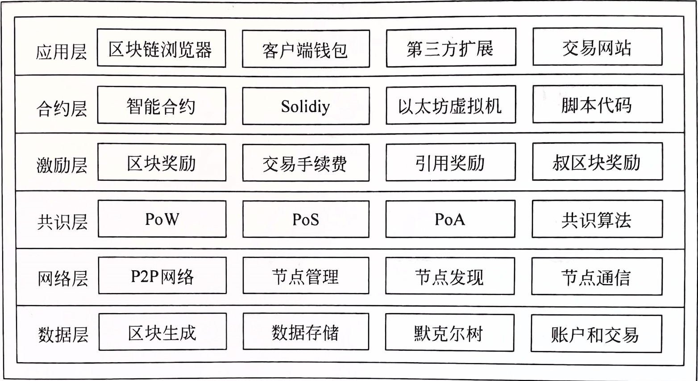
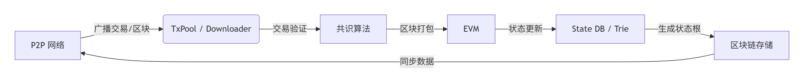
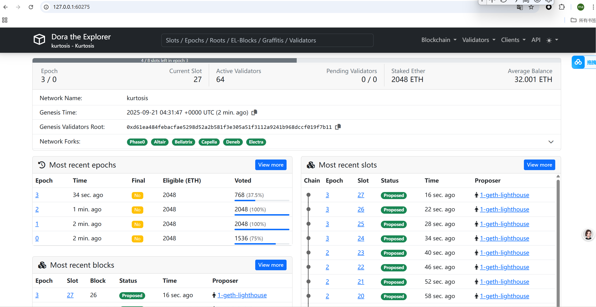
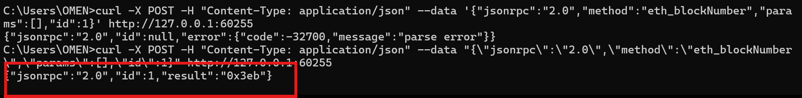
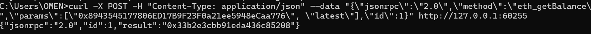
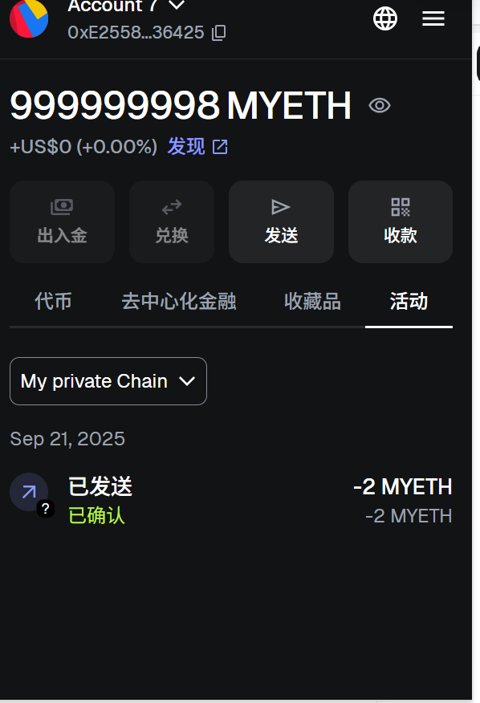

# Geth 在以太坊生态中的定位

## 1. 定位
Geth 是 Go 语言编写的以太坊客户端，它实现了完整的以太坊协议，包括网络层、共识层、钱包层、智能合约层等。
Geth 定位为开发者工具，可以用来开发、调试和部署智能合约，也可以用来参与以太坊的网络。
## 2. 功能
Geth 具有以下功能：
- 网络层：实现了以太坊的网络协议，包括节点发现、消息路由、同步、状态同步等。
- 共识层：实现了以太坊的共识算法，包括 PoW、PoS、Casper 等。
- 钱包层：实现了以太坊的钱包功能，包括创建、导入、管理等。
- 智能合约层：实现了以太坊的智能合约功能，包括编译、部署、调用等。
## 3. 适用场景
- 开发者工具：Geth 可以用来开发、调试和部署智能合约。
- 参与网络：Geth 可以用来参与以太坊的网络，包括同步、节点发现等。
# 核心模块交互关系
## 1. 区块链同步协议（eth/62, eth/63）与其他模块
eth/62 和 eth/63 是以太坊 p2p 通信协议的版本，负责节点之间的区块链数据同步。Geth 通过这些协议从其他节点获取区块数据，更新本地区块链副本。
在同步过程中，新获取的区块数据会传递给 EVM 执行环境进行验证和执行，以确保本地区块链状态与网络一致。同时，交易池中的交易也会随着区块链的同步而被打包进新的区块
## 2. 交易池管理与 Gas 机制
交易池用于存储尚未被打包进区块的交易。当用户发起一笔交易时，该交易首先会进入交易池等待打包。Gas 机制是以太坊中用于计费的方式，它决定了交易执行所需的费用。
交易池中的每笔交易都需要指定 Gas 限制和 Gas 价格，Gas 限制表示交易愿意消耗的最大 Gas 量， Gas 价格则是用户愿意为每单位 Gas 支付的金额。Geth 会根据交易的复杂程度计算实际消耗的 Gas 量，
并在交易执行完成后，将剩余的 Gas 返回给用户。如果交易执行过程中 Gas 耗尽，交易将被回滚
## 3. EVM 执行环境构建与其他模块
EVM 是以太坊虚拟机，是 Geth 中负责执行智能合约和交易的核心模块。它为智能合约提供了一个安全、隔离的执行环境。当交易池中的交易被打包进区块后，会由 EVM 来执行。EVM 执行交易时，会读取交易中的指令和数据，
进行相应的计算和状态更新，并将结果记录下来。同时，EVM 还会与底层的存储模块（如 ethdb）进行交互，读取和写入账户余额、合约代码等状态数据
## 4. 共识算法实现（Ethash/POS）与其他模块
在 The Merge 升级前，以太坊使用 Ethash 共识算法，这是一种基于工作量证明（PoW）的算法，Geth 通过 Ethash 模块实现了该算法，用于解决区块生成过程中的竞争问题，
确保区块链的安全性和去中心化特性。在 PoW 机制下，矿工需要通过计算哈希值来争夺区块的打包权，而 Ethash 算法通过生成缓存和数据集，增加了计算的难度和内存需求，
以抵制专用挖矿设备（ASIC）的垄断。升级后，以太坊转向了权益证明（POS）共识算法，其共识协议是「Gasper」，它是在 LMD - GHOST（分叉选择规则）之上应用 Casper FFG（最终性确定工具）构建的。
在 POS 机制下，Geth 作为执行层客户端，
不再负责共识的核心过程，而是与共识层客户端通过 API 进行通信，接收共识层的指令，如新区块的生成通知等，并根据指令执行相应的操作，如验证区块、执行交易等

# 架构图
## 层级关系

## 交易流程

# 实践案例
## 安装 docker
1. 1.sudo apt-get remove docker docker-engine docker.io containerd runc
2. 2.sudo apt-get update
3. sudo apt-get install ca-certificates curl gnupg lsb-release
4. 3.sudo mkdir -p /etc/apt/trusted.gpg.d
5. curl -fsSL https://download.docker.com/linux/ubuntu/gpg | sudo gpg --dearmor -o /etc/apt/trusted.gpg.d/docker.gpg
6. 4.# 对于 x86_64/amd64 架构（绝大多数 Ubuntu 主机）
7. echo "deb [arch=$(dpkg --print-architecture) signed-by=/etc/apt/trusted.gpg.d/docker.gpg] https://download.docker.com/linux/ubuntu $(lsb_release -cs) stable" | sudo tee /etc/apt/sources.list.d/docker.list > /dev/null
8. 5.sudo apt-get update
9. sudo apt-get install docker-ce docker-ce-cli containerd.io docker-compose-plugin
10. 6.sudo systemctl start docker
11. 7.sudo systemctl status docker
12. 8.docker --version  # 查看客户端版本
13. sudo docker version  # 查看客户端+服务器版本（需 sudo）
## 安装kurtosis
1. echo "deb [trusted=yes] https://apt.fury.io/kurtosis-tech/ /" | sudo tee /etc/apt/sources.list.d/kurtosis.list
2. sudo apt update
3. sudo apt install kurtosis-cli**
## 运行
1. kurtosis run github.com/kurtosis-tech/basic-service-package --enclave quickstart  # 运行一个基本的服务包
2. kurtosis run github.com/kurtosis-tech/ethereum-package --args-file ./network_params.yaml --image-download always  # 运行一个完整的以太坊节点 ，参考官方文档配置network_params.yaml文件
## 停止并删除
kurtosis clean -a  # 停止并删除所有运行的实例
## 区块浏览器
dora 是一个区块链浏览器，可以用来探索区块和交易。

cl-1-lighthouse-geth​​ & ​​el-1-geth-lighthouse​​: 这些很是一个​​以太坊共识层（CL，Consensus Layer）​​ 和​​执行层（EL，Execution Layer）​​ 的客户端组合。Lighthouse 是共识层客户端，Geth 是执行层客户端。它们一起工作来运行一个以太坊节点。
​​dora​​: 是一个​​区块链浏览器​​或​​监控工具​​（例如，Dora 指用于探索区块和交易的工具）。
​​validator-key-generation-cl-validator-keystore​​: 从名称看，这个容器负责为共识层（CL）​​生成验证者密钥对​​，这是参与权益证明（PoS）验证的关键步骤。
​​vc-1-geth-lighthouse​​: 是一个​​验证者客户端（Validator Client, VC）​​，它使用先前生成的密钥来代表验证者执行职责（如提议和证明区块）
## 使用 JSON-RPC 命令行调用

私有链的 RPC 接口成功解析请求（没有格式错误）
当前区块高度为 0x3eb（十六进制），转换为十进制是 1003 块
私有链节点正在正常出块（已产生 1003 个区块）
RPC 端口 60255 是正确的，且本地可以正常访问私有链
## 使用 JSON-RPC 命令行调用以太坊 查询余额
curl -X POST -H "Content-Type: application/json" --data "{\"jsonrpc\":\"2.0\",\"method\":\"eth_getBalance\",\"params\":[\"0x8943545177806ED17B9F23F0a21ee5948eCaa776\", \"latest\"],\"id\":1}" http://127.0.0.1:60255

## 通过metaMask连接私有链完成交易转账

    