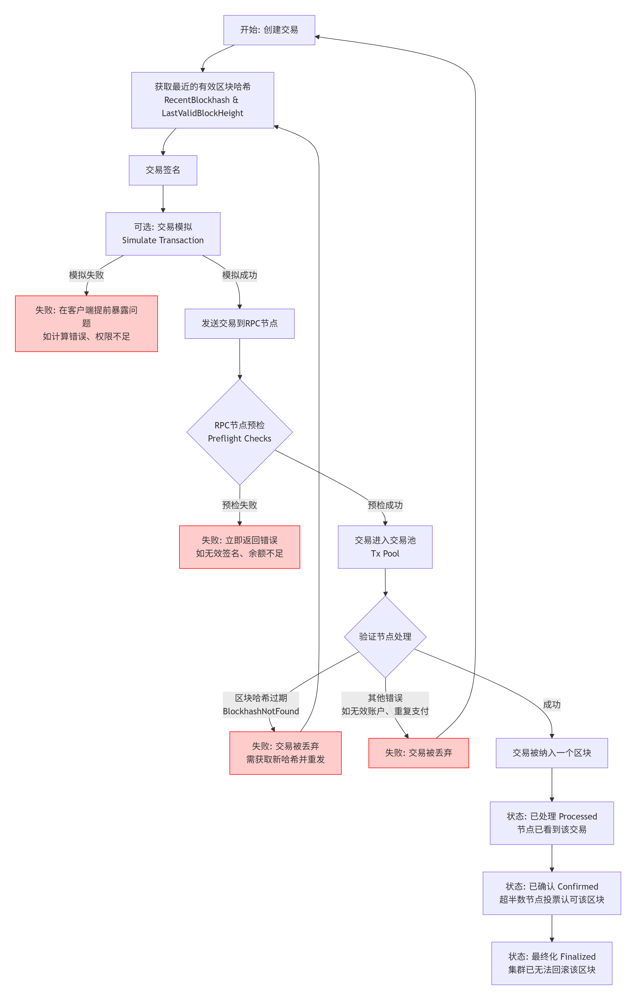
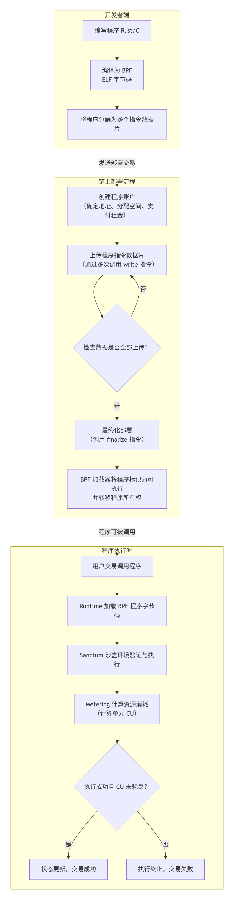

以下是针对 Solana 交易生命周期、BPF 加载器工作原理及账户存储模型对比的详细说明，结合技术细节与可视化逻辑整理：

---

### **一、Solana 交易生命周期流程图**

1. 创建与签名 (Client Side)
​​获取区块哈希 (Recent Blockhash)​​：交易必须包含一个近期的区块哈希作为“时间戳”，以确保其新鲜度。​​此哈希的有效期很短（约60-90秒）​​，这是您遇到 BlockhashNotFound错误的主要原因。
​​签名 (Signing)​​：使用发送方的私钥对交易进行签名。没有有效签名的交易会被网络立即拒绝。

2. 模拟与发送 (RPC Node)
​​交易模拟 (Simulation)​​：可选但强烈推荐的一步。RPC节点在不真正执行的情况下运行交易，返回潜在的错误、日志和消耗的计算单元（CU）。这有助于在支付费用前提前发现逻辑错误。
​​发送交易 (Send Transaction)​​：将已签名的交易广播到一个Solana RPC节点。

3. 预检与传播 (Validator Node)
​​预检 (Preflight Checks)​​：RPC节点会执行一系列基本检查（如签名是否有效、账户余额是否足够支付费用），如果失败则立即返回错误。
​​交易池 (Transaction Pool / Mempool)​​：通过预检的交易被放入交易池，等待验证节点（Validator）拾取。

4. 处理与确认 (Validator & Network)
​​区块生产​​：领导节点（Leader）将交易池中的交易打包到一个新的区块中。
​​BlockhashNotFound发生点​​：如果领导节点发现交易中的区块哈希已经​​过期（超越了 LastValidBlockHeight）​​，它会直接丢弃该交易。​​这就是您错误发生的精确位置。​​
​​状态确认​​：
​​Processed (已处理)​​：一个节点已处理该交易。这​​不是​​最终确认，可能还会被回滚。
​​Confirmed (已确认)​​：该交易所在的区块已被超半数节点投票认可。此时交易通常被认为是安全的。
​​Finalized (最终化)​​：该区块已被集群永久确认，无法回滚。这是最高级别的确认。 

> 💡 **关键特性**：  
> - **并行执行**：非冲突交易（如访问独立账户）由多线程同时处理。  
> - **无全局内存池**：交易直接转发给领导者节点，减少延迟。

---

### ⚙️ **二、BPF 加载器工作原理图**  

BPF（Berkeley Packet Filter）是 Solana 智能合约的沙盒执行引擎，工作流程如下：  
1. **编译与加载**  
   - 合约代码（Rust/C）通过 **LLVM/Clang** 编译为 BPF 字节码，经系统调用 `bpf()` 加载至内核。  
2. **安全验证**  
   - **验证器（Verifier）** 检查字节码：禁止循环、控制流可达性、寄存器/栈状态安全。 程序运行于沙盒中，无法破坏内核。
3. **JIT 编译与挂载**  
   - 通过验证的字节码由 **JIT 编译器**转换为本地机器码，挂载到内核钩子点（如系统调用、网络事件）。 JIT 编译减少解释开销，并行处理提升吞吐量。
4. **事件驱动执行**  
   - 触发事件（如交易调用）时，BPF 程序通过 **Helper 函数**访问内存，结果存入 **eBPF Map**（供用户态读取）。  

---

### 🔀 **三、账户存储模型对比（Solana vs EVM）**  
# Solana 与 EVM 设计差异对比

## 核心架构

| 特性 | **EVM (如以太坊)** | **Solana** |
|:---|:---|:---|
| **执行模型** | 单线程全局状态机。交易按顺序串行处理，无法同时修改同一状态。 | 多线程并行运行时 (Sealevel)。交易显式声明其会访问的账户（状态），无冲突的交易可以并行执行。 |
| **虚拟机** | 基于栈的 **EVM** (以太坊虚拟机)，执行高级语言（如 Solidity）编译的字节码。 | **BPF 加载器**。将程序（编译为 BPF 字节码的 ELF 文件）加载到本地执行环境，利用 LLVM JIT 编译为原生机器码，性能极高。 |
| **交易结构** | 单指令模型：每笔交易通常仅执行一个操作（如转账或调用合约函数），复杂操作需多笔交易。 | 多指令原子性：每笔交易可包含多个指令（Instructions），按顺序原子执行（全部成功或全部回滚）。 |
| **状态模型** | **基于账户的全局状态**。状态存储在全球共享的“世界状态”树中。合约存储是合约内部的键值存储。 | **面向账户模型**，逻辑与状态分离。程序（智能合约）是**无状态**的（代码账户只存字节码）。状态存储在独立的**账户**中，由程序拥有。[1,2,3](@ref) |
| **账户类型** | 外部账户（EOA, 由私钥控制）和合约账户（由代码控制）。 | 可执行账户（存程序代码）和不可执行账户（存数据）。所有账户都可存储数据。 |
| **开发语言** | 主要使用 **Solidity**/Vyper。 | 主要使用 **Rust** (主推), 也支持 C/C++。Anchor 框架简化开发。 |

## 性能与成本

| 特性 | **EVM (如以太坊)** | **Solana** |
|:---|:---|:---|
| **吞吐量 (TPS)** | 较低（~15-30 TPS），受限于顺序执行。 | 理论极高（~65k TPS），得益于并行处理。 |
| **交易费用** | **Gas 机制**：费用 = 计算复杂度 (Gas单位) * Gas价格（动态，拍卖式）。网络拥堵时费用高昂。 | **计算单元 (CU) + 固定基础费用**：费用更可预测。用户可支付**优先级费用**加速。 |
| **状态存储成本** | 一次性支付 Gas 费用，数据**永久存储**（可能导致状态膨胀）。 | **租金机制 (Rent)**：账户需存储 ≥2 年租金的 SOL 余额（按数据大小计算），否则数据可能被清除。关闭账户可退还租金。 |
| **扩展路径** | 主要通过 **L2 扩容**（Rollups、侧链等）。 | 目标通过其架构（并行、PoH）直接在 **L1** 上实现高吞吐量。 |

## 开发体验与生态

| 特性 | **EVM (如以太坊)** | **Solana** |
|:---|:---|:---|
| **合约交互** | 合约间通过函数调用组合。 | 跨程序调用（CPI）支持组合性。 |
| **状态管理** | 合约内部通过 Storage（映射、变量）管理自身状态。 | 程序通过显式传递和操作独立的**数据账户**来管理状态。 |
| **工具链** | 非常成熟（Hardhat, Foundry, Truffle, Remix）。 | 发展中，Anchor 框架是主流，工具链较新。 |
| **学习曲线** | Solidity 相对易于学习，生态丰富。 | 需理解账户模型、租金等概念，Rust 有门槛。 |
| **升级性** | 需通过代理模式等复杂实现实现可升级合约。 | 程序默认**可升级**（除非显式设置为不可变）。 |

## 共识与安全

| 特性 | **EVM (如以太坊)** | **Solana** |
|:---|:---|:---|
| **共识机制** | **Gasper (PoS + LMD-GHOST)**。 | **Tower BFT (PoS) + Proof of History (PoH)**。PoH 提供全局时间戳。 |
| **签名与验证** | 交易包含一个主要签名（ecrecover）。 | 交易可包含多个签名，需显式列出所有所需签名。 |
| **网络历史** | 曾因拥堵导致 Gas 费飙升，但罕见完全中断。| 曾因高吞吐需求遭遇过多次网络中断。|
| **去中心化程度** | 验证者数量众多，高度去中心化。| 验证者数量相对较少（约千级别），中心化程度较高。|

## 典型应用场景

| 特性 | **EVM (如以太坊)** | **Solana** |
|:---|:---|:---|
| **优势领域** | 复杂的 DeFi 协议、价值存储型应用、NFT 生态（起源地）。 | 高频交易（DEX）、支付、GameFi、社交媒体（成本敏感、高吞吐场景）。 |
| **代币标准** | ERC-20, ERC-721 等。合约内部 mapping 管理余额。 | SPL Token。为每个用户-代币对创建独立的 Token Account。 |
| **用户体验** | L1 费用高，L2 碎片化可能带来复杂性。| L1 费用低且快，但需处理租金和账户管理概念。 |

## 总结与选择

-   **选择 EVM 如果**：优先考虑**生态成熟度、安全性、极致的去中心化**，以及拥有大量现有 Solidity 代码或 expertise。愿意为了这些而接受更高的费用和较低的吞吐量，或接受 L2 的复杂性。
-   **选择 Solana 如果**：优先考虑**极致性能、低延迟和低交易成本**，应用场景需要高吞吐量（如高频交易、游戏）。愿意学习 Rust 和适应其独特的账户模型。

